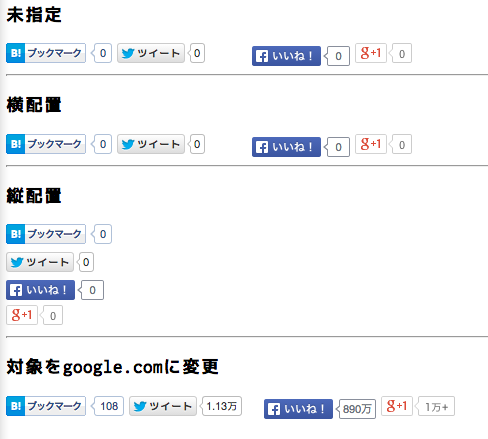

# easy_social_button

「Twitter」「Facebook」「はてなブックマーク」「Google +」のソーシャルボタンを簡単に設置するためのJavascriptです。

自由な設定が出来ない代わりに、最低限の手順で使えます。

なお、jQueryに依存しています。

# 使用方法

## JSを読み込む

```html
<script type="text/javascript" src="https://code.jquery.com/jquery-2.1.1.min.js"></script>
<script type="text/javascript" src="../dest/easy_socialbutton.js"></script>
```

## 表示させたい箇所にタグを配置する

### 横配置

```html
<div class="social-button"></div>
```

### 縦配置

```html
<div class="social-button" data-design="vertical"></div>
```

### URLとテキストを変更

```html
<div class="social-button" data-url="http://google.com" data-title="google.com"></div>
```



# TODO

- 横配置の際に表示がずれている
